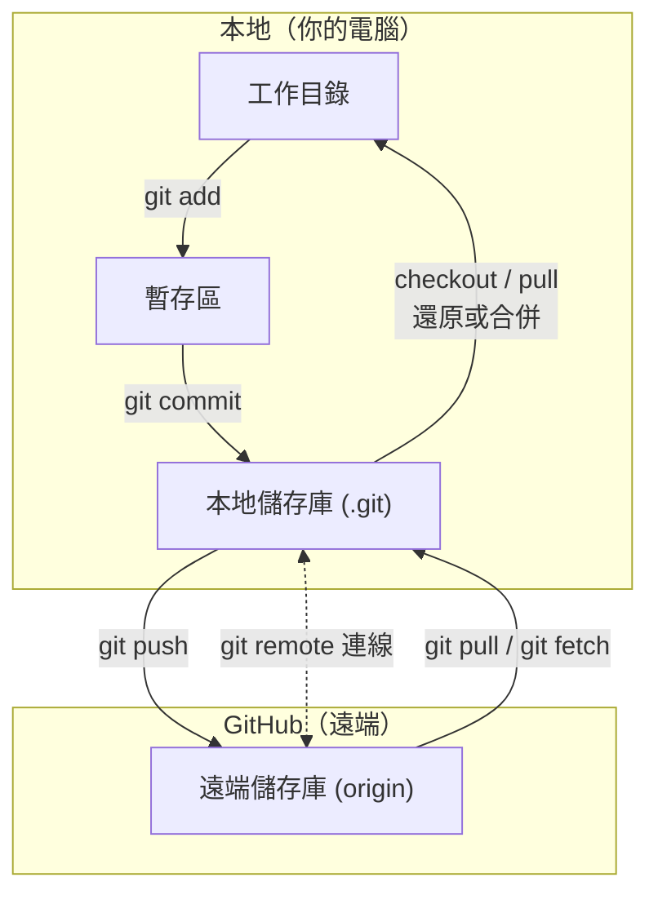

# 2.5 GitHub

> **Git** 是版控工具, 跑在你電腦上 <br>
> **GitHub** 是託管 Git 儲存庫的網站, 提供遠端備份與協作介面 <br>
> 可以想成: Git 管「怎麼記版本」, GitHub 管「版本放在哪裡、怎麼跟別人分享」

<br><br>


## Git + GitHub 合併流程總覽



<br><br>


## 情境 A: 從零開始的新專案

> 本地還沒有 repo, 要在 GitHub 上開一個新的

```
1. git init                          # 本地初始化
2. 改檔案 → git add → git commit      # 本地先存版本（見 2.3）
3. 到 GitHub 建立空 repo
4. git remote add origin [url]       # 綁定遠端
5. git push -u origin main           # 第一次推送, 建立追蹤關係
```
> 先有本地 commit, 再連 GitHub
> 第一次 push 建議加 -u

<br><br>


## 情境 B: 加入別人（或自己）已有的專案

> 遠端已經有 repo, 你要一份到本地開發

```
1. git clone [url]                   # 遠端整包複製到本地（含 .git）
2. 改檔案 → git add → git commit      # 本地開發
3. git pull                          # 推送前先拉遠端更新（團隊必做）
4. git push                          # 推回 GitHub
```

> clone 一次就含 remote, 通常不用再 remote add
> 團隊協作細節見 2.4
<br><br>


## 情境 C: 團隊日常循環（本地）

```
git pull                    # 1. 開工前, 拿遠端最新版
git checkout -b feature-x   # 2. 開功能分支（可選但建議）
# ... 改檔案 ...
git add → git commit        # 3. 本地存版本
git push -u origin feature-x # 4. 把分支推上 GitHub
# 5. 到 GitHub 開 Pull Request, review 後合併（見下方）
```

> 團隊協作時, 多半不直接在本地 merge 到 main 再 push
> 而是 push 功能分支後, 在 GitHub 用 **Pull Request** 請人看過再合併

<br><br>


## Pull Request（PR）是什麼

> **Pull Request** 不是 git 指令, 是 **GitHub 網頁上的功能** <br>
> 白話說: 「本地這邊改好了, 請負責人看一下(code review), 沒問題再併回主線」

<br><br>


### PR 在做什麼

> 你在功能分支上 commit 並 push 之後, 到 GitHub 對 main（或其他目標分支）開一張 PR <br>
> PR 頁面會顯示: 改了哪些檔案、差異(diff)、討論留言、是否通過檢查 <br>
> 同事 review 完、確認沒問題, 再由有權限的人按下 **Merge** 合併進主線

<br><br>


### 為什麼要用 PR

> **Code Review** — 別人幫你看有沒有 bug、寫法是否合理 <br>
> **討論紀錄** — 為什麼這樣改、留存在 PR 留言裡 <br>
> **保護 main** — main 不讓人直接 push, 只能透過 PR 合併（團隊常這樣設定）<br>
> **CI 檢查** — 合併前跑測試, 紅了就不該 merge

<br><br>


### PR 基本流程

```
1. git checkout -b feature-login     # 本地開功能分支
2. 改檔案 → add → commit（可多次）
3. git push -u origin feature-login # 推上 GitHub
4. GitHub 上按「Compare & pull request」開 PR
5. 同事 review、討論、修改（可再 commit + push, PR 會自動更新）
6. 選擇 Merge 方式合併進 main
7. 刪除遠端功能分支（可選, 保持乾淨）
```

#PR 是 GitHub 協作介面, 底層仍是 branch + merge
#push 分支 → 開 PR → review → merge
<br><br>


## GitHub 上的 Merge（重點）

> 本地 git merge 是你在自己電腦上合併 <br>
> GitHub 上合併 PR 時, 通常有幾種按鈕可選; 這裡著重兩種最常見的:

<br><br>


### 普通 Merge（Create a merge commit）

> GitHub 按鈕名稱通常是 **Create a merge commit** <br>
> 功能分支上的**每一個 commit 都會保留**, 並在 main 上多一個 **merge commit** 把兩邊接起來

```
main:     A --- B ------------------- M (merge commit)
                      \             /
feature:               C --- D --- E
```

> **優點** <br>
> - 完整保留開發過程, 每個 commit 都還在歷史裡 <br>
> - 之後要追查「當初怎麼一步步改的」比較清楚 <br>
> **缺點** <br>
> - main 歷史會比較雜, commit 多時圖會分叉、不好讀 <br>
> **適合** <br>
> - 想保留完整開發紀錄的專案 <br>
> - 每個 commit 都有意義、值得單獨留下

#普通 merge = 保留全部分支 commit + 一個 merge commit
#對應本地 git merge 的概念
<br><br>


### Squash Merge（Squash and merge）

> GitHub 按鈕名稱是 **Squash and merge** <br>
> 把功能分支上**全部 commit 壓成 1 個 commit**, 再併進 main <br>
> 分支上原本的 C、D、E 不會個別出現在 main 歷史裡, 只會看到壓縮後的那一筆

```
main:     A --- B --- S (squash 後的單一 commit, 內容 = C+D+E 的總和)

feature:  (C --- D --- E  在 PR 頁面仍看得到, 但 main 上只有 S)
```

> **優點** <br>
> - main 歷史乾淨, 一個功能 = 一個 commit, 好讀 <br>
> - 開發中「修 typo」「測試又改」等小 commit 不會污染 main <br>
> **缺點** <br>
> - main 上看不到你當初那 5 次零碎 commit 的細節（PR 頁面還留著）<br>
> **適合** <br>
> - 功能分支 commit 很碎、但併進 main 只想留一筆「完成功能 XXX」<br>
> - 團隊希望 main 保持線性、好讀

#squash merge = 多個 commit 壓成 1 個再併入 main
#main 乾淨, PR 頁面仍有完整討論與 commit 紀錄
<br><br>


### 普通 Merge vs Squash Merge

| | 普通 Merge | Squash Merge |
|---|---|---|
| main 上的 commit 數 | 保留分支上每一筆 + merge commit | 通常只多 **1 筆** |
| main 歷史 | 較完整, 可能較雜 | 較乾淨、一功能一 commit |
| 開發過程 | 從 main 歷史可追溯 | 細節在 PR 頁面, 不在 main 歷史 |
| 常見場景 | 重視每步紀錄 | 重視 main 可讀性 |

> 沒有絕對對錯, 看團隊習慣; 很多團隊對 main 用 **Squash merge**, 對長期維護的分支用普通 merge <br>
> 合併前確認團隊規範, 不要自己亂選

#開 PR 前先問團隊用哪種 merge
#個人專案自己決定即可
<br><br>


## 常用指令在流程中的位置

| 階段 | 指令 | 作用 |
|---|---|---|
| 取得專案 | `git clone` | 從 GitHub 複製到本地 |
| 連線遠端 | `git remote add origin [url]` | init 後綁定 GitHub |
| 上傳 | `git push` | 本地 commit → GitHub |
| 下載(只更新不合併) | `git fetch` | 更新遠端資訊, 不動工作目錄 |
| 下載(更新+合併) | `git pull` | 遠端 → 合併進本地分支 |
| 查看連線 | `git remote -v` | 確認 origin 指向哪個 URL |

> 指令語法細節見 `1.2 Instruction`

<br><br>


## Git 與 GitHub 的關係整理

> 沒有 GitHub, Git 仍然可以完整運作（本地 add / commit / branch / merge）<br>
> 沒有 Git, GitHub 只是一個空殼, 存不了版本歷史 <br>
> 兩者搭配: 本地用 Git 管版本, GitHub 管遠端備份與多人協作

# Git = 工具, GitHub = 平台
# 流程: 工作目錄 → add → commit → push → GitHub
